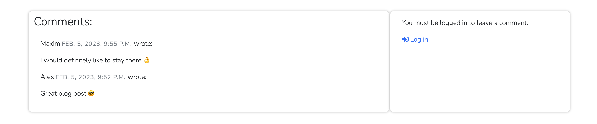
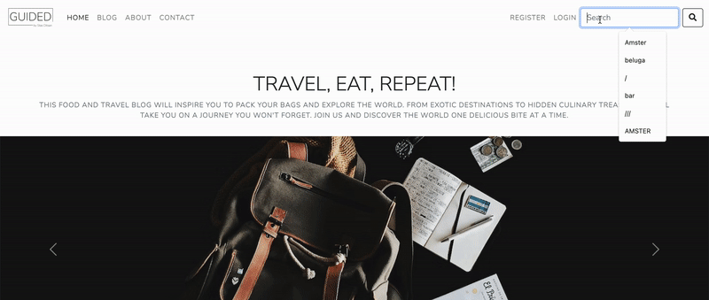
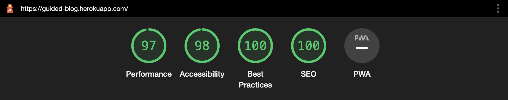

Guided is a travel blog that covers a variety of topics. Its purpose is to create a platform for the author to share travel experiences, greatest places to visit, best places to dine, and anything else related to travel as well as to express views, expertise, and insights to a bigger audience. Also, create a strong community.

  

 

#### Click [here](https://stanislavditsan.github.io/The-Beluga/) to visit the website.

# Table of Content
- [User Experience](#user-experience)

  * [Admin Experience](#admin-experience)

  * [Main Objectives](#main-objectives)

  * [UX Principles](#ux-principles)

  * [Strategy](#strategy)

- [Models](#models)  

- [Features](#features)

  * [Navigation bar](#navigation-bar)

  * [Landing page](#landing-page)

  * [Recent Posts](#recent-posts )

  * [Intro about me ](#intro-about-me )

  * [Travel Gallery](#travel-gallery)

  * [Footer](#footer)

  * [Create blog ](#create-blog)

  * [Blog ](#blog)

  * [Post Details ](#post-details)

  * [Edit Blog](#edit-blog)

  * [Delete Blog](#delete-blog)

  * [Share on social media ](#share-on-social-media)

  * [About](#about)

  * [Contact](#contact)

  * [Search](#search)

  * [Category](#category)

  * [Login - Register](#login-register)

  * [Logout](#logout)

- [Design](#design)

  * [Typography](#typography)

  * [Color](#color)

  * [Imagery](#imagery)

  * [Icons](#icons)

- [Wireframes](#wireframes)

- [Technologies Used and Tools](#technologies-used-and-tools)

- [Languages Used](#languages-used)

- [Testing](#testing)

  * [Lighthouse](#lighthouse)

  * [Code Validation](#code-validation)

  * [Browser Compatibility](#browser-compatibility)

  * [Responsiveness](#responsiveness)

- [Bugs](#bugs)  

- [Deployment](#deployment) 

- [Credits](#credits)

  * [Media](#media)

  * [Acknowledgements](#acknowledgements)

  # User Experience
## As a first time visitor I am able to:

1. Use Navigation bar that provides clear and easy to use navigation links, allowing to quickly switch between webpages.

2. Perform a quick search using a search function located in the navigation menu.
3. See slogan and brief description of the website.
4. Experience slides with travel imagery and travel quotes which can inspire to travel more.
5. See automated typing and greeting with a user name, if website user was logged in.
6. Experience design of the site as it is minimalistic and clean, making it easy for to focus on the content and on the blog.
7. View a page with a complete list of blog posts and pagination controls.
8. View the latest blog posts on the homepage, with the ability to navigate through older posts using scrolling on computer and swiping through on mobile or tablet.
9. See the blog posts title, time it was created and the date, who it was created by, what category it’s related to and be ability to quickly use shortcuts to get to desired blog or categories as well as pagination with buttons.
10. A button with collapsable section as into about the owner of the blog. There I can see the name of the owner his avatar and short story.
11. See section travel gallery cards.
12. See the footer with social media links and copyright details. 
13. Find about page with information about the website and owners goals towards readers
14. Fill in contact form with my name, email and message so I can get in contact with owner or admin of the website 
15. Navigate to register page or sign up page so I can access website functionality such as comments, likes and ability to delete my previously posted comments.
16. Quickly sign in with Google.
17. View 404 page with information that the page is not found and a button to go back to the home page.
18. Experience some animations across most of the pages. 
19. See messages that indicates if I have was logged in or signed out.
20. Comment and view the message that my comment is awaiting approval. 
21. Like and dislike blog posts.
22. Easily share blog posts with generated link related to post via Facebook, Twitter, Reddit, Telegram and WhatsApp 
23. See the total amount of views on each post. 
24. See other users comments with. information like time, date and who wrote it
25. See Log in link in comment section only if not logged in.

# Admin Experience

## As an admin of the website I am able to:

1. Add a blog post without having to access the admin panel.

2. Add content to a blog using summernote widget without having to access the admin panel. 
3. Pick a status for the blog draft or published without having to access the admin panel. 
4. Add an image without having to access the admin panel. 
5. Add a category to a blog post without having to access the admin panel. 
6. Add a different author if blog was written by someone else without having to access the admin panel. 
7. Delete blog post without having to access the admin panel. 
8. View a warning notice before the blog post is deleted.
9. Delete comments without having to access the admin panel. 
10. View list of contacts from users that submitted contact form with their name, email and message in admin page. 
11. View the list of users from admin panel. 
12. View the accounts from admin panel. 
13. View a list of all postings from the admin panel.
14. Use filters and search option in admin panel. 
15. Approve and disapprove comments in admin panel. 
16. Manage social applications from admin panel.

# Main objectives

1. To Read Blog Posts: The primary objective for most users of the site is to read the blog posts and get information on a variety of topics.

2. To Engage with the Community: Users may be interested in leaving comments on the blog posts and engaging with the community of readers and other users.
3. To Explore Different Topics: The blog covers a variety of topics, and users may be interested in exploring different topics and learning more about the subjects that interest them.
4. To Access the Site from Any Device: With its responsive design, users can access the site from any device, including desktop computers, laptops, tablets, and smartphones, making it easy to stay up-to-date with the latest blog posts wherever they are.
5. To Share the Site with Others: Users may be interested in sharing the site with others, either by sharing specific blog posts or by spreading the word about the site more generally. This can help to increase the visibility of the site and attract new readers.
6. To Stay Up-to-Date: Users may also be interested in staying up-to-date with the latest blog posts, as they are updated regularly.
7. To Find Information Quickly: With its clear and easy-to-use navigation links, users can quickly find the information they're looking for on the site or perform a quick search. 
8. To Learn About the Site: Users may be interested in learning more about the site and its purpose, as well as the author of the blog, which they can do by visiting the "About" page.

# UX Principles 

## The design of Guided Blog is centered around the following UX principles:

- Usability: I want my users to be able to find and get the information they need with a simple and intuitive navigation system.

- Accessibility: I attempt to make our site accessible to all visitors, including those with impairments, by emphasizing clear and legible font and a color scheme that is easy to navigate.

- Engagement: My goal is to provide users with an engaging and delightful experience through visually appealing design components and an emphasis on high-quality content.

# Strategy  

- My approach for Guided Blog is to provide a platform for useful and engaging blog postings on a variety of travel themes. My primary goal is to provide value to my users through high-quality content and an easy-to-use interface. I hope to establish a devoted and active readership and to consistently enhance my platform through feedback. 

# Models 

### This project contains the following models:

## Post: This model is used to represent a blog post and contains the following fields:

- title: Title of the blog post
- slug: Slug for the URL
- author: Foreign key to the User model representing the author of the post
- featured_image: Image for the post, stored using the CloudinaryField
- excerpt: Short description of the post
- updated_on: Last updated timestamp for the post
- content: Content of the post, stored as SummernoteTextField
- created_on: Timestamp for when the post was created
- category: Category the post belongs to
- status: Status of the post, either Draft or Published
- likes: Many-to-Many relationship with the User model representing users who have liked the post
- views: Number of views the post has received

## Comment: This model is used to represent a comment on a blog post and contains the following fields:

- user: Foreign key to the User model representing the user who left the comment
- post: Foreign key to the Post model representing the post the comment was left on
- name: Name of the user who left the comment
- email: Email of the user who left the comment
- body: Body of the comment
- created_on: Timestamp for when the comment was created
- approved: Boolean field indicating whether the comment has been approved or not

## Category: This model is used to represent a category and contains the following fields:

- name: Name of the category
- description: Description of the category

## Contact: This model is used to represent a contact message and contains the following fields:

- name: Name of the sender
- email: Email of the sender
- message: Message sent by the sender

# Features

## Navigation Bar

- The navigation bar has a clean and modern design with hover effects and a bespoke logo.

- The navigation bar helps the user to quickly access all of the website's features.

- The navigation bar is visible or accessible on all website pages.

- The navigation bar has the following links: home, (create blog - for admin only)  blog, about, contact, register, login, logout.

- The search bar is included in the navigation bar.

- Bootstrap provided the navigation bar code snippet.

- The navigation bar is designed to function on both large and small displays.

  

## Landing Page

### Slogan and a short overview.

- The landing page includes the website's Slogan and a short overview. Below that is a carousel of travel images and inspirational phrases. Quote writers were also included.

### Welcoming text

- The landing page also includes an automated welcoming text. If the user is signed in, their name will appear in the greeting text. Otherwise, the automated typing will not contain a name.

  

## Recent Posts

- Recent blog posts are displayed on the home page so that users can rapidly browse by scrolling  through the blog posts and choose their blog for reading by clicking on the title or category to view more alternatives on this topic. Hoover effects are available for a better user experience.

  

## Intro about me 

- Intro about me is a collapsible button that has the owner's avatar, name, and a welcome with a brief about me text.

  

## Travel Gallery

- Gallery cards are provided to show website visitors travel images from trips.

## Footer

- The footer area contains links to The Guided's important social media

- For the user's convenience, the links will open in a new tab.

- When hovering over the social media links, a nice hoover effect appears.

- The footer assists the user by encouraging them to stay active on social media.

- Copyright is also included.

  

## Create blog 

### Add blog post

- This function is only available to super user!

- No other users have access to it.

- This function allows you to quickly make a blog post without having to visit the Django administrative page.

- Summernote widget allows you to add and style content.
Author and title are optional.

- Excerpt field is also present.

- The slug field will fill the blog name in the url field.

- You may also change the status and category, as well as upload a picture.

  

## Blog 

### Blog page 

- If the page contains more than 6 blog posts, pagination buttons will show at the bottom of the blog.

- To improve user experience, each blog is designed as a card with hover effects.

- Author, title, category, date, time, and total number of likes are all included on each blog card.

  

## Post details 

- Inside the blog, you'll find the same information as on the blog card, as well as the actual blog post details, below you'll notice the total number of comments, likes and page views.
- Only the user who made the comment will be able to delete it.

  

- After you've posted your comment, you'll see a notification stating that it was successfully added and is being reviewed.

- There are two sections: comments where you can view a list of comments and submit a comment part that is only viewable to registered or signed in users.

  

- Below that are two buttons: delete blog and edit blog, which are only visible and accessible to admin.

  

  

## Edit blog

- Edit blog post has the same functionality as add blog post, but it just modifies the blog post.

## Delete blog 

- Delete Blog Post button will take admin to a new page with a delete button. If the administrator decides to delete a blog post, a warning message stating "Are you sure you want to delete this post?" will appear.

  

 

- After clicking OK, the blog post will be removed from the database.

## Share on social media 

- Share on social media is a collapsible button that contains social media icons.

  

 

- When you click on a certain social network symbol, it creates a URL with the current blog article for you to share.

## About

- The About page provides information about the site and its purpose. This page includes details about the author of the blog, and the goals and objectives of the blog.

- The information on this page can help users to better understand the content of the blog, as well as the motivations and perspectives of the author.

## Contact 

- The contact page is a page with a simple form where users can contact the site owner.

  

 

- They can leave their name, email, and message so that administrator can view all of the information that the user has provided via the admin panel.

## Search 

- Approach is to use the Django ORM (Object-Relational Mapping) to filter the queryset of post based on the search keyword using a combination of __contains, __icontains and Q lookups.

  

 

## Category

- For the user, category is a beneficial feature. When a website has a lot of blog posts, users can easily go to their desired category and view related blogs.

  

 

## Login - Register 

- The login page is used to manage the site's user accounts. Existing users can login in to their accounts using the "Login" page, while new users can make an account via the "Register" page.

  

 

- Users can also sign in using their Google account.

## Logout

- Users can sign out of their accounts and end their current session by using the website's Logout page.

  

 

- Take notice of the notification indicating when the user logs in and out.

# Design 

- The design of the website is clean and minimalistic, with a focus on simplicity and readability.

- The website features a white background with black text, making it easy for users to read the content of the blog. 

- The design is uncluttered, with plenty of white space around the text and images. This helps to create a sense of balance and order on the site, making it easier for users to focus on the content of the blog.

## Typography

- The website uses a simple, [Nunito Sans](https://fonts.google.com/specimen/Nunito+Sans) font for the text, which is legible and easy to read. The font is used consistently throughout the site, creating a cohesive and visually appealing design.

## Color

- The colour scheme of the site is mainly **black** and **white**, with a few light accents of blue used for the links. This colour scheme is classic, ageless, and easy on the eyes, making it ideal for a blog that focuses on written content.

## Imagery

- The purpose of the relevant visual imagery is to attract the user's attention and be eye-catching. It also offers a fresh, contemporary look.

## Icons

- Font Awesome provided the icons for this project. They served as social media icons, buttons, and current design elements.

# Wireframes

- The Wireframes were created using [Figma](https://www.figma.com/)

## Large Screen Devices
- Home page
- Blog page 
- Post detail

  

 

- Create blog 
- Delete blog
- About

  

- Contact form
- Register page
- Sign in page

  

## Smaller Devices 

  

# Technologies Used and Tools

[Django](https://www.djangoproject.com/)

- Django is the framework that was utilised to create the project.

[Python](https://www.python.org/)

- Python is the core programming language used to write all of the code in this application to make it fully functional.

[PostgreSQL](https://www.elephantsql.com/)

- I have used ElephantSQL database in deployment to store the data for my models.

[Cloudinary](https://cloudinary.com/)

- Used to store all of my static files and images.

[jQuery](https://jquery.com/)

- To keep the footer at the bottom of the page, jQuery was utilised.

[Pypi.org](https://pypi.org./)
- Finding numerous Django packages was done via Pypi.org.

[GitHub](https://github.com/)

- Used to store code for the project after being pushed.

[Git](https://git-scm.com/)

- Used for version control by utilising the Gitpod terminal to commit to Git and Push to GitHub.

[Gitpod](https://www.gitpod.io/)

- Used as the development environment

[Heroku](https://dashboard.heroku.com/apps)

- Used to deploy my application.

[Summernote](https://summernote.org/)

- Was used to provides a user-friendly interface for creating and editing web content (text, images, videos, etc.) in a web page.

[JSHint](https://jshint.com/)

- Used to validate JS code

[Am I Responsive](https://ui.dev/amiresponsive)

- Used to generate the live site images

[Bootstrap](https://getbootstrap.com/)

- The project utilises the Bootstrap library extensively, mostly to make the site responsive.

[Canva](https://www.canva.com/)
- Was used to make a logo 

[Animate](https://animate.style/) 
- Was used to add animations across all of the pages 

[Figma](https://www.figma.com/) 

- Was used to create wireframes during the design phase.

[Favicon & App Icon Generator](https://www.favicon-generator.org/)

- Used to create a site favicon.

[Google Fonts](https://fonts.google.com/)

- Used to obtain the fonts linked in the header

[Chrome](https://www.google.com/chrome/) 

- Was used to debug and test the website's source code as well as to check for responsiveness.

[Color Contrast Accessibility Validator](https://color.a11y.com/)

- Allowed me to test the colour contrast of my website.

[W3C Markup Validation Service](https://validator.w3.org/)

- Used to validate all HTML code

[W3C CSS Validation Service](https://jigsaw.w3.org/css-validator/)

- Used to validate all CSS code

[Font Awesome](https://fontawesome.com/)

- Icons were utilised across the website using Font Awesome.

[Ezgif](https://ezgif.com/)

- Was used to convert video to GIF files

# Languages Used
- [HTML](https://html.com/)
- [CSS](https://www.w3.org/Style/CSS/Overview.en.html)
- [Python](https://www.python.org/)
- [JavaScript](https://www.javascript.com/)
# Testing

## Automated Testing 

- I used the [Coverage library](https://coverage.readthedocs.io/en/7.1.0/) during testing to keep track of how much of my Python code was covered by the tests I wrote.

- My website has 72% of its code tested, according to the coverage report. Manual testing is used to cover the remaining code.

### To build your own coverage report from the command line:

1) **pip3 install coverage**

2) Run coverage **run manage.py test**

3) **coverage html** to build the report.

4) View the report in a browser by running **python3 -m http.server** and then viewing the index.html file from the **htmlcov folder**.

## [Manual Testing](TESTING.md)

### I tested this project to ensure that everything works properly.
### [TESTING.md](TESTING.md)

## Lighthouse

- Chrome DevTools' Lighthouse is used to audit a site for performance, accessibility, progress, and SEO.

# Code Validation

### W3C HTML Validator

- HTML validator passed with no errors

### W3C CSS Validator

- CSS validator passed with no errors

# Browser Compatibility

- The website was checked for errors using  Safari, and Google Chrome. Across a range of device sizes and browsers, appearance, functionality, and responsiveness remained constant.

## Responsiveness

- Google Chrome DevTools were used to run responsive design tests.

- Additionally, I put it to the test on an iPad Pro, a MacBook Pro, an iPhone 8, and an iPhone 11.

## Color Contrast Accessibility Validator
- I was able to examine the colour contrast of my website using Color Contrast Accessibility Validator

# Bugs

## During the process of working on this project, I encountered a few bugs.

### When I submitted the form for create blog I got the error: 
- ***clean() got an unexpected keyword argument 'styles'***

###  How did I solve this problem?

1. I've upgraded bleach to the newest version

2. Downgraded summernote

### The function wasn't working when trying to sign up and log in. 

### How did i solve this problem?

1. I added ***ACCOUNT_EMAIL_VERIFICATION = "none"*** to my settings.py

### Google auth wasn’t working correctly

### How did i solve this problem?
- I provided support for authentication 
1. I added ***SOCIALACCOUNT_LOGIN_ON_GET = True*** in my settings.py and set it to True

### The image was not loading when an image file was submitted using the add post.html form.

### How did i solve this problem?
1. I Added attribute in the form ***enctype="multipart/form-data"***
2. I added form definition in forms.py ***class ImageUploadForm(forms.Form):
    image = forms.ImageField()***

# Deployment

## This project was created with the GitPod by committing to git and pushing to GitHub.
To launch the website to GitHub, the following procedures were followed:

## Create an application
1. If you don't already have a [Heroku](https://id.heroku.com/login) account, create one and log in.

2. Create a new application by clicking "Create new app" after selecting the "new" button on the top right of the dashboard.

3. Choose a distinctive name for the application and then click "Create App" to proceed.

## ElephantSQL
4. Log in with GitHub and create a new instance at [ElephantSQL](elephantsql.com).
5. Once the project instance has been created, copy the URL. This value can also be saved as an environment variable and used in settings.py to equal the DATABASES variable.
5. Install the dj-database-url package version 0.5.0 with pip3 install dj database url==0.5.0 then update the requirements.txt. **pip3 freeze --local > requirements.txt**

# Cloudinary
6. Create a [cloudinary](https://cloudinary.com/) account.
7. Copy the Cloudinary API URL from your dashboard.

# Final Steps
8. By entering python3 manage.py makemigrations followed by python3 manage.py migrate into the terminal, make sure to perform any necessary migrations for the project.
9. Verify that your Procfile contains the following: **web: gunicorn [project_name].wsgi:application**
To the project is added wsgi:application.

# Heroku Deploy
You will need to set your Environment Variables - this is a key step to ensuring your application is deployed properly.

11. Return to Heroku, click the Project's page, select "options," then scroll down to the "Config Vars" section.

12. Enter the following key-valuen pairs in the “Config Vars” section:

13. Key = PORT : Value = 8000
14. Key = SECRET_KEY : Value = Django Secret Key value obtained from settings.py
15. Key = DATABASE_URL : Value = ElephantSQL URL
16. Key = CLOUDINARY_URL : Value = Cloudinary API URL
16. Next select the "Deploy" tab and find the GitHub deployment method by scrolling down.
17. Find the appropriate repository by performing a search, and then click the "Connect" option to connect to it.
18. Locate the type of deployment you wish to carry out at the bottom of the "Deploy" Page by scrolling down. Every time you push new code to your repository, it will deploy if you choose to "Automatically Deploy." If not, you must manually deploy by clicking the button at the page's bottom.
19. The application is now deployed!

# How should this project be carried out locally?
To clone this project from GitHub, follow these steps:

1. Access the Project GitHub repository.

2. Under the repository name click on the ‘Code’ tab

3. Click the clipboard icon in the clone box's HTTPS tab.

4. Open GitBash in your IED.

5. Change your current working directory to the location where the cloned directory will be created.

6. Type "git clone" and then paste the GitHub URL.

7. Press enter and the local clone will be created.

# How to Fork the Repository?
Forking the repository creates an alternate copy that can be edited without affecting the original.

1. Log in to Github and navigate to the desired repository.

2. Click "fork" at the top of the repository.

A copy of your github account will now be created.

After forking a repository, you can send the original author a pull request.

# Credits

- Coding issues have been resolved with the help of [Stack Overflow](https://stackoverflow.com/).

- [AppsLoveWorld](https://www.appsloveworld.com/) was used to solve problems, during development

- [Developer.mozilla.org](https://developer.mozilla.org/en-US/) used as a resource for project development  

- Finding numerous Django packages was done via [Pypi.org](https://pypi.org./).

- [W3Schools](https://www.w3schools.com/) is used for creativity, problem-solving, and ideas.

# Media
The [Unsplash](https://unsplash.com/) website provided some of the photographs I used.

# Acknowledgements 

I want to express my gratitude to the team at Code Institute for creating such a great program for learning web development. My ability to comprehend and construct my own project has been greatly aided by your thorough instructions and guides. Also, student care for assistance and understanding.
Many thanks!

[Go to top](#)